```mermaid
flowchart TD
    %% Consumer Layer
    subgraph "Consumer Applications"
        direction TB
        ConsumerApps["Consumer Apps"]:::external
    end

    %% Registry
    Registry["npm/GitHub Packages Registry"]:::registry

    %% Entry Point
    Entry["Package Entry Point\n(src/index.ts)"]:::entry

    %% Core Modules
    subgraph "Core Modules"
        direction TB
        Cloudinary["Cloudinary Upload Service\n(src/cloudinary.upload.ts)"]:::core
        Middleware["HTTP Gateway Middleware\n(src/gateway.middleware.ts)"]:::core
        ErrorHandler["Centralized Error Handler\n(src/error.handler.ts)"]:::core
        Logger["Logging Utility\n(src/logger.ts)"]:::utility
        Helpers["Miscellaneous Helpers\n(src/helpers.ts)"]:::utility
    end

    %% Interfaces
    

    %% External Dependencies
    subgraph "External Dependencies"
        direction TB
        CloudAPI["Cloudinary API"]:::external
    end

    %% Build & Publish Pipeline
    subgraph "Build & Publish Pipeline"
        direction TB
        Babel["Babel Preset\n(scripts/babel-preset.js)"]:::pipeline
        BuildScript["Build/Publish Logic\n(scripts/build-package.js)"]:::pipeline
        Workflow["GitHub Actions Workflow\n(.github/workflows/publish.yml)"]:::pipeline
        TSConfig["TypeScript Config\n(tsconfig.json)"]:::pipeline
        NPMRC["NPM Config\n(.npmrc)"]:::pipeline
    end

    %% Relationships
    ConsumerApps -->|install from| Registry
    ConsumerApps -->|import| Entry

    Entry -->|exports| Cloudinary
    Entry -->|exports| Middleware
    Entry -->|exports| ErrorHandler
    Entry -->|exports| Logger
    Entry -->|exports| Helpers
    Entry -->|exports types| AuthI
    Entry -->|exports types| BuyerI
    Entry -->|exports types| SellerI
    Entry -->|exports types| OrderI
    Entry -->|exports types| GigI
    Entry -->|exports types| ReviewI
    Entry -->|exports types| ChatI
    Entry -->|exports types| EmailI
    Entry -->|exports types| SearchI

    Cloudinary -->|calls| CloudAPI

    Workflow -->|triggers| BuildScript
    BuildScript -->|uses| Babel
    BuildScript -->|uses| TSConfig
    BuildScript -->|uses| NPMRC
    BuildScript -->|publishes to| Registry

    %% Click Events
    click Entry "https://github.com/pandit-abhishek1/01sharedlibraryservices/blob/main/src/index.ts"
    click Cloudinary "https://github.com/pandit-abhishek1/01sharedlibraryservices/blob/main/src/cloudinary.upload.ts"
    click Middleware "https://github.com/pandit-abhishek1/01sharedlibraryservices/blob/main/src/gateway.middleware.ts"
    click ErrorHandler "https://github.com/pandit-abhishek1/01sharedlibraryservices/blob/main/src/error.handler.ts"
    click Logger "https://github.com/pandit-abhishek1/01sharedlibraryservices/blob/main/src/logger.ts"
    click Helpers "https://github.com/pandit-abhishek1/01sharedlibraryservices/blob/main/src/helpers.ts"
    click AuthI "https://github.com/pandit-abhishek1/01sharedlibraryservices/blob/main/src/interfaces/auth.interface.ts"
    click BuyerI "https://github.com/pandit-abhishek1/01sharedlibraryservices/blob/main/src/interfaces/buyer.interface.ts"
    click SellerI "https://github.com/pandit-abhishek1/01sharedlibraryservices/blob/main/src/interfaces/seller.interface.ts"
    click OrderI "https://github.com/pandit-abhishek1/01sharedlibraryservices/blob/main/src/interfaces/order.interface.ts"
    click GigI "https://github.com/pandit-abhishek1/01sharedlibraryservices/blob/main/src/interfaces/gig.interface.ts"
    click ReviewI "https://github.com/pandit-abhishek1/01sharedlibraryservices/blob/main/src/interfaces/review.interface.ts"
    click ChatI "https://github.com/pandit-abhishek1/01sharedlibraryservices/blob/main/src/interfaces/chat.interface.ts"
    click EmailI "https://github.com/pandit-abhishek1/01sharedlibraryservices/blob/main/src/interfaces/email.interface.ts"
    click SearchI "https://github.com/pandit-abhishek1/01sharedlibraryservices/blob/main/src/interfaces/search.interface.ts"
    click Babel "https://github.com/pandit-abhishek1/01sharedlibraryservices/blob/main/scripts/babel-preset.js"
    click BuildScript "https://github.com/pandit-abhishek1/01sharedlibraryservices/blob/main/scripts/build-package.js"
    click Workflow "https://github.com/pandit-abhishek1/01sharedlibraryservices/blob/main/.github/workflows/publish.yml"
    click TSConfig "https://github.com/pandit-abhishek1/01sharedlibraryservices/blob/main/tsconfig.json"
    click NPMRC "https://github.com/pandit-abhishek1/01sharedlibraryservices/blob/main/.npmrc"

    %% Styles
    classDef core fill:#D0E8FF,stroke:#0366D6,stroke-width:1px
    classDef utility fill:#E6FFED,stroke:#28A745,stroke-width:1px
    classDef interface fill:#FFFAE6,stroke:#D69F00,stroke-width:1px
    classDef pipeline fill:#F0F0F0,stroke:#6A737D,stroke-width:1px,dashArray: 2 2
    classDef entry fill:#BEE3F8,stroke:#3182CE,stroke-width:1px
    classDef registry fill:#FDE68A,stroke:#D97706,stroke-width:1px
    classDef external fill:#FFE4E6,stroke:#D73A49,stroke-width:1px
```

### Shared Services

---
A **shared library of services and utilities** for Node.js/TypeScript projects. This package centralizes commonly used modules (helpers, API wrappers, middlewares, etc.) so they can be reused across multiple applications without duplication.

---
---
### 🔑 Core Modules

* **Cloudinary Upload Service** (`src/cloudinary.upload.ts`)
* **HTTP Gateway Middleware** (`src/gateway.middleware.ts`)
* **Centralized Error Handler** (`src/error.handler.ts`)
* **Logging Utility** (`src/logger.ts`)
* **Miscellaneous Helpers** (`src/helpers.ts`)

---

---

---

* **Cloudinary Upload Service** (`upload`)
* **Auth Service** (tenant authentication, JWT helpers)
* **Logger Utility** (standardized logging across apps)
* **Error Handler Middleware** (centralized error formatting)
* **Mail Service** (send mails with attachments / PDFs)( upcoming)
* **PDF Generator** (HTML → PDF via Puppeteer) (upcomming)
* **Validation Utilities** (schemas & request validation) 
* **Common Helpers** (date/time, string, number utilities)

---
## 🚀 Installation

```bash
# Using npm
npm install @pandit-abhishek1/sharedservices

# Using yarn
yarn add @pandit-abhishek1/sharedservices

# Using pnpm
pnpm add @pandit-abhishek1/sharedservices
```

---

## 📦 Usage

Import and use the services in your project:

```ts
// Example: Import a helper
import { upload } from '@pandit-abhishek1/sharedservices';

async function main() {
  try {
    const result = await upload('./file.png', 'profile-pic');
    console.log('Uploaded:', result.secure_url);
  } catch (err) {
    console.error('Upload failed:', err);
  }
}
main();
```

---

## 📂 Project Structure

```
01SharedLibraryServices/
│── src/               # Core source code
│   ├── services/      # Shared services
│   ├── utils/         # Utility functions
│   └── index.ts       # Package entry point
│── scripts/           # Build & release scripts
│── package.json       # Package metadata
│── tsconfig.json      # TypeScript configuration
│── .npmrc             # npm registry configuration
```

---

## 🛠 Development

Clone the repository and install dependencies:

```bash
git clone https://github.com/pandit-abhishek1/01SharedLibraryServices.git
cd 01SharedLibraryServices
npm install
```

Build the package:

```bash
npm run build
```

Run tests (if added):

```bash
npm test
```

---

## 📤 Publishing

To publish to GitHub Packages / npm:

```bash
npm run build
npm publish
```

> Make sure you’re logged in with the correct registry (`.npmrc` is already set up for GitHub Packages).

---

## ✅ Features

* Reusable services for Node.js apps
* TypeScript support out-of-the-box
* Centralized error handling & helpers
* Easy to integrate with existing projects

---

## 📜 License

This project is licensed under the **MIT License** – feel free to use it in your projects.

---

